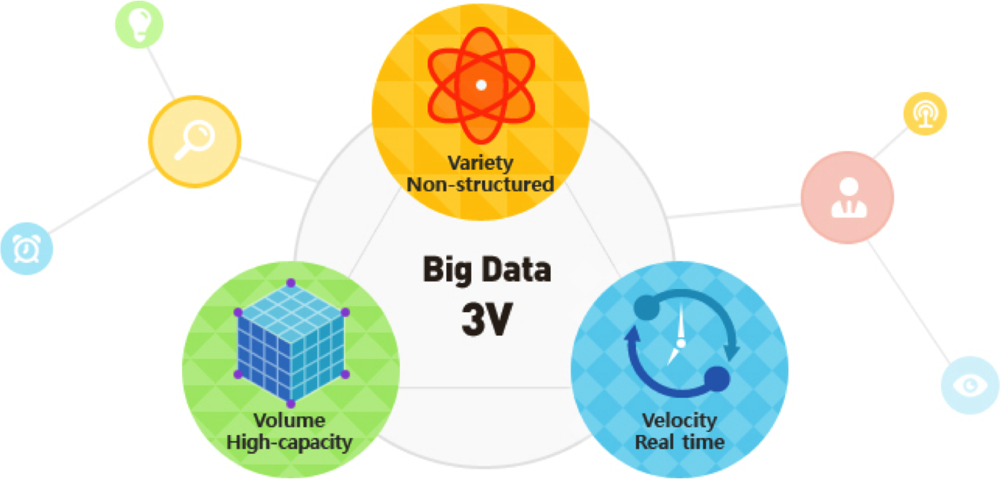
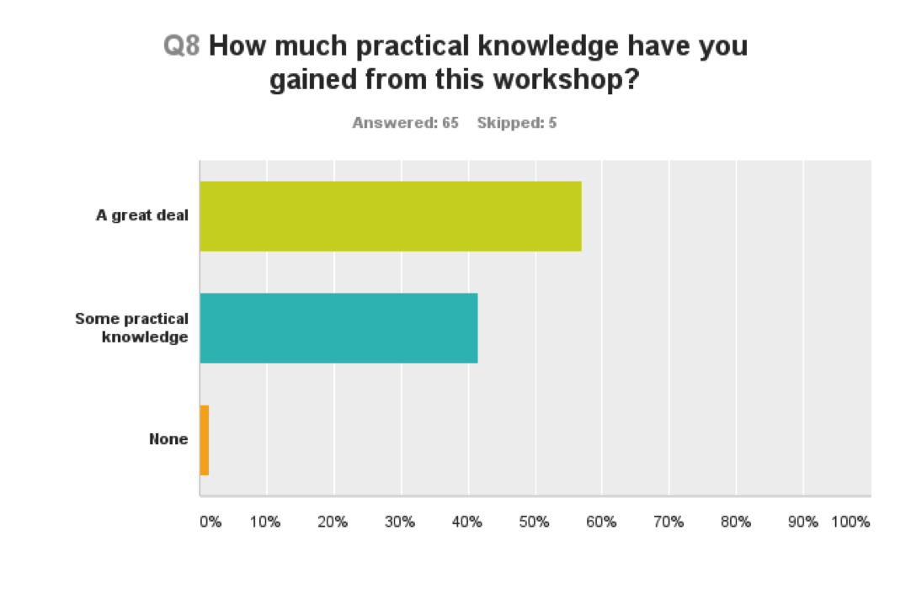
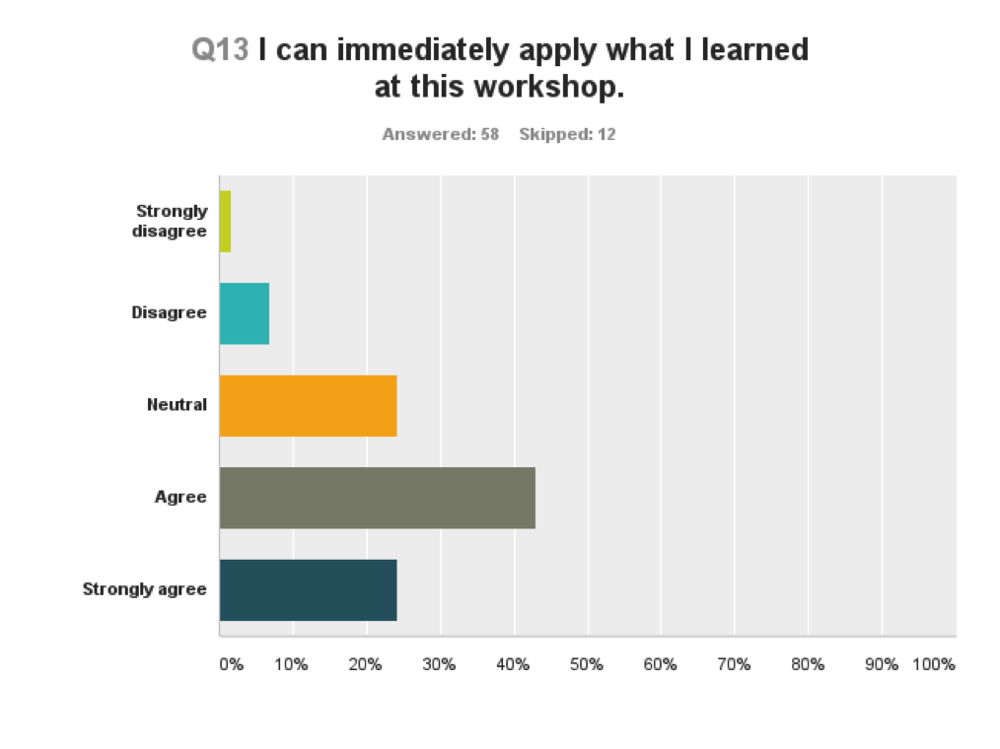
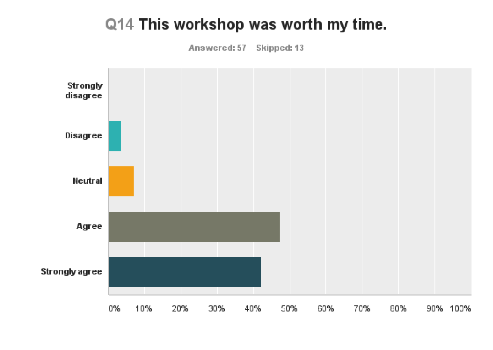

# This is an exciting time to do work and research

---

Data production is no longer the bottleneck.

We can collect and analyze data that givs us information and
insight in a way we never could before. It opens up possibilities
for the types of work we can do and questions we can ask. 

---

But with the opportunity to collect data there comes challenges
and frustrations. That's part of why we're here today, to present and learn from each other how people are addressing the challenges.

## {.flexbox .vcenter}

Software and tools allow us to turn data into information

We put a lot of emphasis on the development of tools and approaches, and rightfully so. These tools help us get to the 'now what' and turn data into information. Grants and VCs support this work
that give us a new view of the data or a way to use it. 

## {.flexbox .vcenter} 

People turn information into knowledge

It is not the tools that do the work to turn data into knowledge
or make the discoveries. People are the ones who turn information 
into knowledge. 

## {.flexbox .vcenter} 

By putting the data skills and the perspectives in the hands of people who have the questions, we allow them to follow their curiousity and capture their passion and expert knowledge.

When we limit the number or types of people who
do this work, we're losing that curiousity, that drive, that
expert knowledge.

Story about person. Who better to do or be a part of the analysis
of the ... gemone than the person who has spent their entire 
career working on it. If they hand it to me, I'm not as movitated,
 and I might not even get it right.
 

# Unleash the potential of data by empowering people

Data and people can reach their full potential when 
we give more people the skills and perspective to 
work effectively with data.

It's more than the skills, and also the perspective
to understand what's possible with data. How it's stored, how
we can access it, the types of outcomes we can see. It's often
difficult to understand what you can do, without knowing what's possible.

# How do we scale data skills and literacy along with data production?

## Researchers want these skills

[BRAEMBL community survey report](http://braembl.org.au/news/braembl-community-survey-report-2013)

# It's never too early or late to start learning

## Training in the Gaps: Active researchers and employees

Active researchers and employees are learning these skills "on the job"

No time or focus for semester courses or even MOOCs

Need to develop and deliver training that fits in their time and attention.

## Training in the Gaps: Active researchers and employees

Researchers need training that is immediate, accessible, appropriate for their level and relevant to their domain.

No time or focus for semester courses or even MOOCs

Need to develop and deliver training that fits in their time and attention.

## Training in the Gaps: Active researchers and employees

This training needs to include not only technical skills, but ways of thinking about data to provide learners with the knowledge of what is possible along with the confidence to continue self-guided learning.

## Training in the Gaps: Active researchers and employees

Additionally, we need to give researchers the opportunity to engage in deliberate practice as they learn these skills, starting with strong foundational skills and receiving feedback as they learn

## Software and Data Carpentry

- Learning objectives: Best practices in software development and data analysis & management
- Delivery approach: intensive, hands-on teaching strategies in 2-day workshops, informed by educational pedagogy
- Delivery mechanism: collaboratively developed lessons available on-line for free use, instructors trained to teach
- Assessment: assessment surveys for both assessing learning outcomes and improving content

Software Carpentry founded by Greg Wilson in 1998 and then re-booted in 2010

- Identified learning objectives as core skills in software development best practices and data analysis and management best practice, based on needs seen in the community
- Used research in educational pedagogy to develop intensive, hands-on teaching strategies for 2-day workshops; trained some instructors in teaching strategy

## Scaling data training with collaboratively-developed curriculum

Advantages:

- Don't need to write something new
- Lessons taught frequently, so constantly improved
- Lessons can be agile, and adpated for new releases or tools
- Openly licensed means that they can be used in our workshops, or in other contexts
- Modular format means things can be mixed and matched

Challenges:
- Discovery of high-quality or appropriate materials
- Lessons might not be maintained

## Lessons

# What do we teach?

## Data Carpentry

Data Carpentry workshops are for any researcher who has data they want to analyze, and no prior computational experience is required. This hands-on workshop teaches basic concepts, skills and tools for working more effectively with data.

- Focused on data - teaches how to manage and analyze data in an effective and reproducible way.
- Initial focus is on workshops for novices - there are no prerequisites, and no prior knowledge computational experience is assumed.
- Domain specific by design – currently have lessons in ecology, in genomics developed with iPlant, in geospatial data developed with NEON, and on APIs with rOpenSci

## Data Carpentry

Biology

- Data organization with spreadsheets
- OpenRefine for data cleaning
- R or Python for data analysis and visualization
- SQL for data management

## Data Carpentry

Genomics

- data organization and metadata
- cloud computing
- command line
- automating bioinformatics workflows
- R for data analysis

## Data Carpentry

Geospatial data

- working with spatial and vector data in R

## Software Carpentry

- Focused on better software development practices, for writing software or analysis scripts
- Domain agnostic

## Software Carpentry

- Introduction to programming with Python or R
- github for version control
- command line for automation

## Repositories of lessons

[http://software-carpentry.org/lessons/](http://software-carpentry.org/lessons/)

## Outcomes

- Learner outcomes
- Instructor outcomes
- Community!

## Learner Outcomes

## Learner Outcomes

## Learner Outcomes

## Instructor outcomes

- People learn new techincal skills
- They have a community - no more 'lone bioinformatician'
- People become better communicators
- Gain value from giving back and empowering people with the skills they have learned are valuable

## Community!

An active and engaged community of instructors and learners, both using
and advocating for best practices in effective and reproducible research

How best to support, sustain and grow this community?

Survey question about strongly agree that you would recommend to a friend

## Summary

- Active researchers and employees are very motivated, but need 'on the job' training
- Training for active researchers needs to teach in the gaps
- Different challenges & opportunities in the training process that potentially require different strategies for support and different groups to develop and deliver

## What can you or your organization do?

- Support training within your organization
- Support training efforts for people before they get to your organization
- Good documentation of software
- Enabling 'power tools' for all

## Acknowledgements

- Over 900 volunteers worldwide that teach and develop lessons
- Greg Wilson, who founded Software Carpentry
- The Steering Committees of Software and Data Carpentry
- Software and Data Carpentry staff: Jonah Duckles, Greg Wilson, Erin Becker, Maneesha Sane and Kari Jordan

## Acknowledgements
- Alfred P. Sloan Foundation
- Gordon and Betty Moore Foundation
- National Science Foundation

